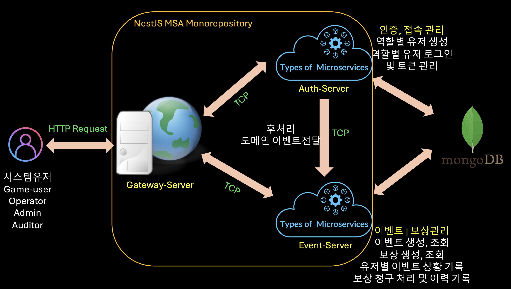

# Game User Event Reward Management


## Description
본 Game User Event Reward Management 서비스는 가상의 게임 시스템을 구성하여, 운영자, 관리자 계정이 만든 이벤트와 보상이 확인될 때 게임 유저가 조건 충족에 따라 보상을 수령할 수 있는 서비스 입니다. 

NestJS 프레임워크를 사용하여 만든 3개의 Server Application으로 구성되며 각각의 역할은 다음과 같습니다.

### Gateway Server: 
- 클라이언트의 HTTP 요청을 받아 연결한 마이크로서비스로 라우팅하는 역할을 수행하는 서버입니다. 호출한 클라이언트의 요청이 유효한지와 적절한 권한을 가졌는지 여부를 판단합니다.

### Auth Server: 
- 관리자, 유저(일반 게임유저), 운영자, 감사자 4개 역할 계정의 등록과 토큰 관리를 담당합니다.
- 등록된 이벤트의 조건에 따라 캐릭터 생성, 로그인, 로그아웃 이후 보상 검증을 위한 도메인 이벤트를 Event Server로 발송합니다.

### Event Server: 
- 운영자, 관리자 계정이 이벤트를 등록하고 보상을 생성(및 연관 이벤트에 책정), 조회를 할 수 있는 서버입니다. 
- 이벤트 생성 후 보상 연결 여부를 보고 활성화/비활성화를 할 수 있으며, 활성화 시 게임 유저에게 이벤트 목록으로 볼 수 있게 해줍니다.
- 활성화 된 이벤트에 대해 게임유저가 보상을 요청하면 수령 자격에 맞는지 조건 검증을 진행하고, 여러 수령 불가 사유에 대한 보상 수령 이력을 남깁니다.
- 유저는 자신의 보상 수령 이력을 확인할 수 있고, 관리자, 운영자, 감사자 는 전체 유저의 보상 수령 이력을 확인할 수 있습니다.


# About Project Running

## Running Environment

이 프로젝트는 node v18.x에서 구동되는 NestJS 기반 애플리케이션입니다. 따라서 node 버전이 높거나 낮으면 구동이 원활하게 되지 않을 수 있어 버전을 맞춰서 진행해야 합니다. 

``` bash
$ node -v
```

node version이 다르다면 [nvm](https://github.com/nvm-sh/nvm) 을 사용해서 v18.x를 install 해서 사용할 수 있습니다.
``` bash
$ nvm install 18.20.2 && nvm use 18.20.2
```

## Installation

노드 버전을 맞춰주었다면 이 프로젝트에 필요한 필수 라이브러리들을 설치합니다.

```bash
$ pnpm install
```

프로젝트 실행에 필요한 노드 패키지들을 설치하였다면 프로젝트 구동에 필요한 DB 등 인프라 구축이 필요합니다.

먼저 개발환경에 docker desktop 설치를 합니다. 그리고 `docker-compose.yml`에 정의한 컨테이너 PORT가 이미 점유중인 것은 아닌지 확인합니다.

본 프로젝트에는 mongoDB v6을 기본 데이터베이스로 사용하며, 간단하게 mongoDB의 내용을 확인하기 위한 ui 툴인 mongo-express도 탑재하였습니다. 아래 명령어를 통해 프로젝트 바탕 인프라를 구축할 수 있습니다.

```bash
# 테스트 인프라 구축
$ pnpm run test_infra_setup
```

```bash
# 테스트 인프라 제거
$ pnpm run test_infra_down
```

## Running the app command

여러 microservice가 유기적으로 구동되는 monorepo를 구성하고 동시 빌드 및 실행을 돕고자 turborepo를 설치하였습니다. 아래 명령어를 통해 간단하게 빌드, 개발, 프로덕션 배포(실행)까지 할 수 있습니다.

```bash
# 개발서버 실행
$ pnpm run dev

# 전체 빌드
$ pnpm build # 또는 $ pnpm turbo build

# 빌드 이후 production mode 실행
$ pnpm run start:prod:<auth | gateway>
```

## 개발 편의 툴 제공

1. Swagger API 확인 및 테스트
개발모드로 실행한다면 http://localhost:3000/api-docs 를 통해 Swagger API 리스트를 확인하고 테스트 해볼 수 있습니다.
| 대체 툴: curl, Postman 등

2. MongoDB database, collection, document 확인
test_infra_setup 이후 브라우저에서 http://localhost:8081 로 이동하여 프로젝트 실행 중에 저장된 데이터를 간단하게 확인 할 수 있습니다.
| 대체 툴: MongoDB-Compass 또는 DataGrip 등 외부 IDE 연동


## format & lint

```bash
# 전체 파일 formatting
$ pnpm format
```

```bash
# 전체 파일 lint
$ pnpm lint
```

## 이벤트 조건 검증 방식

현 버전에서는 유저의 로그인 횟수, 추천인 n명 달성 이벤트 보상에 대해 간단히 검증해볼 수 있으며, 신규 이벤트 등록 및 관련 트래킹 이벤트를 추가하는 서버 업데이트 이후에 지원 가능 범위는 확대될 예정입니다.

1. 운영자 생성 및 로그인 후 Authorization header에 token을 담아서 이벤트를 생성합니다. 
2. 보상 아이템을 생성합니다.(ex. 극한 성장의 비약, 5,000 메이플 포인트 교환권, 경험치 2배 쿠폰 등)
3. 보상 등록을 통해 연결할 이벤트와 보상 아이템을 입력하고, 이벤트 활성화를 합니다.
4. 유저의 생성, 로그인 등의 액션을 통해 유저별로 활성화된 이벤트의 조건 progress 데이터가 생성되고, 유저는 자신의 판단하에 조건이 충족된다 싶으면 특정 이벤트에 대한 보상 요청을 할 수 있습니다.
5. 로그아웃 기능은 아직 구현이 되지 않아, 로그인 이후 DB에서 수동으로 값을 변경해주어야 접속 가능합니다.(실제 접속 계정 중복 방지 참고)

# 📝 본 개발을 수행하며...

### 이벤트 설계 과정


개발에 착수하기에 앞서 요구 사항 명세를 꼼꼼하게 살펴보며 발생할 수 있는 시나리오, 로직에 대한 이벤트스토밍을 위와 같이 진행했습니다.
DDD(도메인 주도 개발) 방법론을 활용하여 핵심 도메인을 체크해서 애그리거트루트로 삼은 뒤 이벤트와 바운디드컨텍스트를 그려나갔습니다.

이후 이 애그리거트루트가 담을 필드와 MongoDB document에 저장될 데이터를 간단하게 구상한 후 구현하며 필요에 맞게 더하거나 뺐으며, 이벤트 등록 후 유저가 조건을 충족하기 위해 값의 자동 변화 감지가 필요한 것은 이벤트 드리븐 방식으로 개발해야겠다 판단했습니다.

한편, 유저 생성(회원가입)은 하나의 API에 role을 body에 담아주는 것보다 role 별로 API를 별도로 관리하는 것이 향후 해당 Route는 InBound/OutBound IP 를 통해 일반 유저의 생성 및 각종 권한 시도도 방지할 것이라 생각하고 구현하였습니다.

### 프로젝트 개발 과정
기본 프로젝트 구성과 연계되는 Microservice 앱 개발은 NestJS의 CLI를 활용하였습니다.
각 APP에서는 Presentation-Application-Domain-Infra로 이어지는 4계층 아키텍처를 도입하여 계층에 맞는 관심사 분리를 도입했습니다. 

주 비즈니스 로직 이후 응답과 상관없이 별도 처리가 가능한 부수 로직은 NestJS의 EventEmitter2(Event-server 내부 사용)와 Microservice 메시지 송수신 패턴(Auth -> Event)을 활용해 처리하였고, 이로써 유저의 로그인, 생성과 같은 액션으로 충족가능한 이벤트는 자동 count 및 경우에 따른 보상 청구 시나리오가 가능하게 예외를 더하였습니다.

한편, 프로젝트 개발 용이를 위해 Swagger와 MongoDB-express, 그리고 turborepo를 도입하여 적절히 활용하였습니다. 

### API 구조 선택
API는 최초 버전임을 감안하여 "v1" prefix를 두고, identity-access, event-reward-management라는 틀로 나누어 그뒤 /auth, /events, /rewards 를 구성하였습니다.

auth에서는 앞서 언급한 이유로 role 별 세분화가 필요하겠다 판단하여 하위로 /admins, /operators 와 같이 분류됩니다.

### 구현 중 겪은 고민 및 아쉬운 점
refreshToken과 token Expire 할 수 있는 세션 로직을 더 보강하지 못했습니다. 또한 이벤트 보상 수령 시 이를 저장하고 사용자가 획득한 아이템을 볼 수 있는 Inventory 로직과 내정보 기능 역시 주어진 시간동안 구현하지 못한게 아쉬움이 있습니다.

이벤트와 조건 검증 로직은 더 추가를 하고 싶었으나, 보통 이벤트가 추가될 때 서버 패치 업데이트도 같이 됨을 생각하여 실제 서비스처럼 이후 추가 task로 남기게 되었습니다.

## License

Nest is [MIT licensed](LICENSE).
